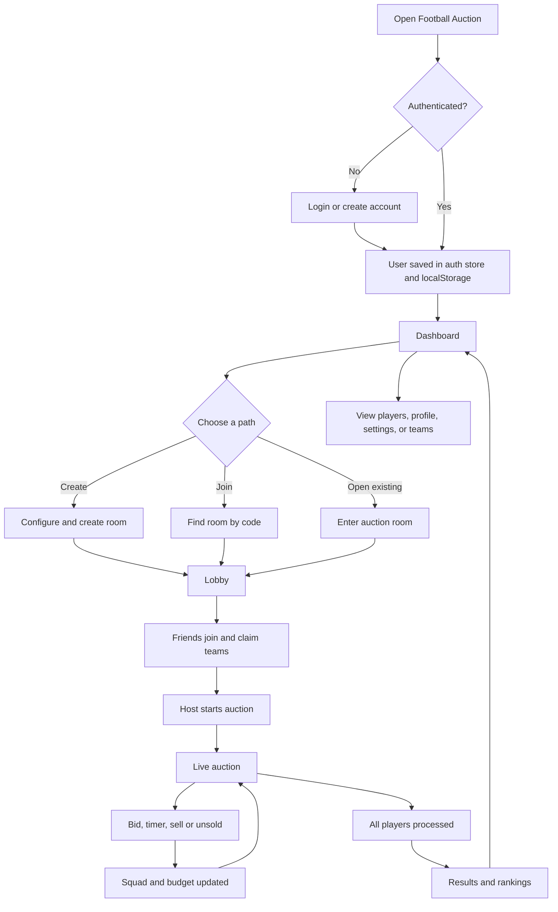
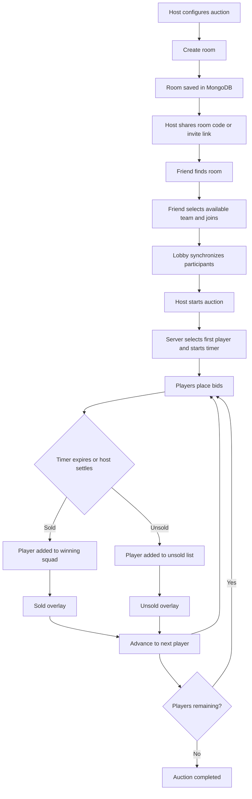

# Auction Workflow

This document describes how the Football Auction application works from the first page visit through authentication, room participation, live bidding, team building, and final results.

## Complete Application Flow



## Architecture Audit: Current Behavior

The following describes what the current implementation actually guarantees:

- Room mutations such as create, join, claim, leave, start, chat, presence, bid, settlement, advance, and status changes use the revision-checked `updateById()` or `updateByCode()` path in [roomStore.ts](src/lib/server/roomStore.ts).
- MongoDB compare-and-swap is implemented by `persist()`, which replaces a document only when its stored `rev` still matches the revision read by the request. Conflicting requests retry against the newer room.
- WebRTC signal writes use atomic MongoDB operator updates on the `signals` array and increment `signalRev`, not the auction `rev`. Signal draining is also atomic and does not change the auction revision.
- Chat messages remain embedded in the room document, but chat writes use an atomic update and increment `chatRev`, not the auction `rev`. Chat traffic therefore no longer forces bid or settlement CAS retries. Chat and auction data are still not separate realtime streams.
- Settlement is guarded by the current overlay and sold/unsold lists. Repeated settlement requests return the already settled state rather than adding a second sale. Bids now accept a `commandId`; repeated requests with the same ID replay the original bid result.
- Host-only commands are checked on the server, not only hidden in the UI. Settlement, manual advance, pause, resume, cancellation, and live-state publishing require the room's `hostId`.
- The client timer does not decide expiry. `useAuctionTimer` updates the local display from the server-derived deadline, while server `progressLive()` performs expiry and settlement during room reads and state-changing actions.
- The server computes room time from `timerEpoch` and `timeRemaining`. A bid resets the timer only when `enableTimerReset` is enabled. Routine live-state publishing does not restart an already running timer.
- Host heartbeat loss is handled in two stages. The first stale observation records `hostOfflineSince`; cancellation occurs only after another 90-second grace window without recovery. An authenticated host room read or presence update clears the offline marker.
- Intentional host leave and explicit cancellation are immediate terminal actions. Cancellation now stores `cancellationReason` as `host_left`, `host_cancelled`, or `heartbeat_timeout`, in addition to the human-readable system message.
- WebRTC streams and signals are independent from bid and settlement state. Peer failure does not block auction commands, and auction completion does not intentionally stop a peer connection until the room media component unmounts.
- Auction and chat updates are now also published through an SSE endpoint at `/api/rooms/[auctionId]/events`. The client listens to named `auction` and `chat` events and keeps the existing snapshot polling as hydration and recovery fallback.

The review plan still calls for future improvements that are not yet implemented: replayable idempotency records for every command rather than bids only, structured command logs, reconnect delta recovery, and concurrency-focused automated tests. The current SSE broker is process-local; a multi-instance deployment would need a shared pub/sub layer such as Redis or a managed realtime service.

## Application Startup and Navigation

The root layout loads on every route and wraps the application with shared providers:

- [Root layout](src/app/layout.tsx)
- [Auth guard](src/components/providers/AuthGuard.tsx)
- [Database initializer](src/components/providers/DatabaseInitializer.tsx)
- [Toast provider](src/components/providers/ToastProvider.tsx)

`AuthGuard` hydrates the persisted user from `localStorage` and protects authenticated routes. Public routes are `/`, `/login`, and `/signup`. Unauthenticated users trying to open a protected route are redirected to login with a `next` path. Authenticated users opening login or signup are redirected to the requested path or `/dashboard`.

The root home page is:

- [Home page](src/app/page.tsx)

It shows the public entry screen and sends authenticated users to the dashboard.

## Account Creation and Login

### Sign Up

The user enters their name, username, email, password, and optional favorite club.

Request path:

```text
signup/page.tsx
  -> SignupForm
  -> authStore.signup()
  -> authService.signup()
  -> POST /api/auth/signup
  -> userStore.signup()
  -> MongoDB users collection
```

Files:

- [Signup page](src/app/signup/page.tsx)
- [Signup form](src/components/auth/SignupForm.tsx)
- [Auth store](src/store/authStore.ts)
- [Auth service](src/lib/services/authService.ts)
- [Signup API route](src/app/api/auth/signup/route.ts)
- [User store](src/lib/server/userStore.ts)

The server validates the fields, requires a password of at least eight characters, hashes the password with `scrypt`, creates the user, and returns a public user object. The client stores the authenticated user in Zustand persistence and `localStorage`.

### Login

Login follows the same client-to-server pattern:

```text
login/page.tsx
  -> LoginForm
  -> authStore.login()
  -> authService.login()
  -> POST /api/auth/login
  -> userStore.login()
  -> MongoDB users collection
```

Files:

- [Login page](src/app/login/page.tsx)
- [Login form](src/components/auth/LoginForm.tsx)
- [Login API route](src/app/api/auth/login/route.ts)

On success, the user is available through `useAuthStore`. Logout removes the persisted user and returns the client to an unauthenticated state.

## Dashboard

After authentication, the user reaches:

- [Dashboard layout](src/app/dashboard/layout.tsx)
- [Dashboard page](src/app/dashboard/page.tsx)
- [Dashboard navigation](src/components/dashboard/DashboardNav.tsx)

The dashboard loads auctions through `auctionService.listAuctions()`, which calls `GET /api/rooms`. Rooms are grouped into live and recent auctions. From here the user can:

- Create a new auction at `/auction/create`.
- Join an auction at `/auction/join`.
- Enter an existing room.
- Open the player database.
- Open their profile or settings.

## Player Database and Team Pages

The player database is a browse-only discovery area for available football players:

- [Player database](src/app/player/page.tsx)
- [Player detail](src/app/player/[playerId]/page.tsx)
- [Player card](src/components/player/PlayerCard.tsx)
- [Player profile modal](src/components/player/PlayerProfileModal.tsx)

During an auction, player data is loaded from the configured player dataset by [loadRealPlayers.ts](src/lib/loadRealPlayers.ts). The active auction references player IDs inside ordered buckets rather than copying full player records into every bid.

Team information is available through:

- [Auction teams page](src/app/auction/[auctionId]/teams/page.tsx)
- [Team detail page](src/app/team/[teamId]/page.tsx)
- [Squad pitch](src/components/team/SquadPitch.tsx)
- [Team budget](src/components/team/TeamBudget.tsx)
- [Team store](src/store/teamStore.ts)

Team pages render the latest teams from the room snapshot. Each team contains its manager, available budget, spent amount, squad player IDs, logo, and squad limit.

## Profile and Settings

The profile page loads account statistics and auction history from the profile API:

- [Profile page](src/app/profile/page.tsx)
- [Profile API route](src/app/api/profile/route.ts)
- [User store](src/lib/server/userStore.ts)

Profile data includes hosted and joined auctions, players bought, total spending, current squads, previous squads, and room history.

The settings page manages local user preferences and UI controls:

- [Settings page](src/app/settings/page.tsx)
- [UI store](src/store/uiStore.ts)
- [Sound hook](src/hooks/useSound.ts)

Profile changes update the authenticated user state. Audio tests trigger auction sound effects. Camera and microphone settings are used by the room media flow when the user enters an auction.

## End-to-End Flow



## 1. Create a Room

The host configures:

- Auction name and description
- Number of teams
- Starting budget
- Enabled player buckets and order
- Auction rules and timer duration

Main files:

- [Create auction page](src/app/auction/create/page.tsx)
- [Auction service](src/lib/services/auctionService.ts)
- [Rooms API route](src/app/api/rooms/route.ts)
- [Room store](src/lib/server/roomStore.ts)

`roomStore.create()` creates and persists:

- Auction ID and room code
- Teams and starting budgets
- Host participant
- Player buckets
- Initial live state
- Host heartbeat timestamp

The room starts with status `lobby`.

## 2. Invite Friends and Join the Room

The host shares the room code or invite URL.

A friend:

1. Opens the join page.
2. Enters the room code.
3. Looks up the auction.
4. Selects an available team.
5. Enters a team name.
6. Joins the room.

Main files:

- [Join auction page](src/app/auction/join/page.tsx)
- [Auction service](src/lib/services/auctionService.ts)
- [Auction room API route](src/app/api/rooms/[auctionId]/route.ts)
- [Room store](src/lib/server/roomStore.ts)

`roomStore.join()` assigns the selected team, creates the participant, updates `participantIds`, and records the user's heartbeat.

## 3. Lobby Synchronization

The auction layout mounts the room synchronization components:

- [Auction layout](src/app/auction/[auctionId]/layout.tsx)
- [Auction room client](src/components/auction/AuctionRoomClient.tsx)
- [Room synchronization hook](src/hooks/useRoomSync.ts)
- [Room media hook](src/hooks/useRoomMedia.ts)

`useRoomSync`:

- Sends participant presence every 4 seconds.
- Fetches a room snapshot every second.
- Updates participants, teams, bids, player, timer, and auction status.
- Redirects users from the lobby to the live page when the auction becomes `live`.

## 4. Start the Auction

The host presses **Start Auction** in the lobby.

The request path is:

```text
lobby/page.tsx
  -> auctionService.startAuction()
  -> POST /api/rooms/[auctionId]
  -> roomStore.start()
```

Main files:

- [Lobby page](src/app/auction/[auctionId]/lobby/page.tsx)
- [Auction service](src/lib/services/auctionService.ts)
- [Auction room API route](src/app/api/rooms/[auctionId]/route.ts)
- [Room store](src/lib/server/roomStore.ts)

`roomStore.start()`:

- Verifies that the requester is the host.
- Sets auction status to `live`.
- Selects the first player from the first enabled bucket.
- Sets the opening bid.
- Initializes `timerEpoch` and `timeRemaining`.
- Adds a system message.
- Persists the new room snapshot.

## 5. Timer Synchronization

The server is authoritative for live timer state.

Main files:

- [Auction timer hook](src/hooks/useAuctionTimer.ts)
- [Auction store](src/store/auctionStore.ts)
- [Room store](src/lib/server/roomStore.ts)

The server stores:

- `timeRemaining`
- `timerEpoch`
- `isPaused`

The remaining time is calculated from the server timestamp:

```text
elapsed = current time - timerEpoch
remaining = timeRemaining - elapsed seconds
```

`liveWithClock()` performs this calculation. Every browser polls room snapshots, and the client derives a local display deadline from the returned server time. This keeps the countdown smooth between polls while the server remains responsible for expiry and settlement.

## 6. Place a Bid

A user presses the bid button on the live auction page.

Main files:

- [Bid button](src/components/auction/BidButton.tsx)
- [Auction store](src/store/auctionStore.ts)
- [Auction room API route](src/app/api/rooms/[auctionId]/route.ts)
- [Room store](src/lib/server/roomStore.ts)

The server validates:

- The auction is live.
- The auction is not paused.
- The correct player is active.
- The team belongs to the user.
- The squad is not full.
- The team has enough budget.
- The bid meets the minimum increment.

The server then updates:

- Current bid
- Highest bidder
- Bid history
- Participant bid indicators
- Timer reset state, when enabled

## 7. Sell a Player

The host can confirm **Sold** from the auction controls.

Main files:

- [Auction controls](src/components/auction/AuctionControls.tsx)
- [Auction store](src/store/auctionStore.ts)
- [Room store](src/lib/server/roomStore.ts)

When a player is sold, `assignPlayerToTeam()`:

- Adds the player ID to the winning team's `squad`.
- Adds the sale amount to `team.spent`.
- Adds the player ID to `soldPlayerIds`.
- Adds an item to auction history.
- Creates a sold overlay.
- Decreases the remaining player count.

After the sold overlay duration, the server advances to the next player.

## 8. Mark a Player Unsold

If the player has no valid winning bid, or the host selects **Unsold**:

- The player ID is added to `unsoldPlayerIds`.
- Auction history records the unsold player.
- An unsold overlay is displayed.
- The auction advances after the overlay duration.

The core settlement logic is in [roomStore.ts](src/lib/server/roomStore.ts).

## 9. Automatic Timer Settlement

When the timer reaches zero:

1. The client timer reaches zero in its display.
2. A room read or state-changing request invokes server `progressLive()`.
3. The current lot is automatically settled.
4. It is sold if there is a highest bidder; otherwise it becomes unsold.
5. The next player is selected.

Main files:

- [Auction timer hook](src/hooks/useAuctionTimer.ts)
- [Auction store](src/store/auctionStore.ts)
- [Room store](src/lib/server/roomStore.ts)

The server runs live progress during room reads and actions. This allows the auction to advance even if one browser temporarily stops rendering or ticking.

## 10. Auction Completion

`advanceLot()` checks every enabled player bucket. When no players remain:

- Auction status becomes `completed`.
- The current player becomes `null`.
- The live state is paused.
- Results show the completed squads, budgets, sold players, unsold players, and history.

Main files:

- [Room store](src/lib/server/roomStore.ts)
- [Results page](src/app/auction/[auctionId]/results/page.tsx)

## 11. Camera and Microphone

Media is handled separately from the auction bidding state.

Main files:

- [Room media hook](src/hooks/useRoomMedia.ts)
- [Participant video card](src/components/participants/ParticipantVideoCard.tsx)
- [Media store](src/store/mediaStore.ts)
- [Auction store](src/store/auctionStore.ts)

The media flow:

1. The room media hook requests camera and microphone access.
2. The local stream is stored in `mediaStore`.
3. Clicking mic or camera retries permission if a needed track is missing.
4. Tracks are enabled or disabled according to the participant state.
5. WebRTC peers exchange offers, answers, and ICE candidates.
6. Participant cards attach local and remote streams to video elements.

Camera and microphone require HTTPS when users connect through a LAN or public address.

## Main Data Path

```text
Browser UI
  -> Zustand stores
  -> auctionService
  -> Next.js API routes
  -> roomStore
  -> MongoDB
```

MongoDB room state is authoritative for:

- Current player
- Current bid
- Highest bidder
- Timer epoch
- Sold and unsold players
- Teams and spending
- Auction status

The main shared snapshot type is [room.ts](src/types/room.ts).

## Chat and Live Media

Chat is part of the room experience and is synchronized through room actions:

- [Chat panel](src/components/chat/ChatPanel.tsx)
- [Chat store](src/store/chatStore.ts)
- [Chat service](src/lib/services/chatService.ts)
- [Room API route](src/app/api/rooms/[auctionId]/route.ts)
- [Room store](src/lib/server/roomStore.ts)

Sending a message posts a `chat` action. The server validates and stores the message in the room record, and the next room snapshot updates every participant's chat store.

### Realtime Room Events

The room event endpoint is [events/route.ts](src/app/api/rooms/[auctionId]/events/route.ts), backed by [roomEvents.ts](src/lib/server/roomEvents.ts). Successful auction CAS commits publish an `auction` event containing the authoritative snapshot. Atomic chat writes publish a separate `chat` event containing only the new message and `chatRev`. Signal writes use a separate `signal` event and continue to use the dedicated signal polling path for actual WebRTC payload delivery.

The client subscribes in [useRoomSync.ts](src/hooks/useRoomSync.ts). Auction events use the same `applySnapshot()` path as polling, while chat events use `chatStore.addMessage()`. If SSE disconnects, the existing one-second room poll continues to recover state.

Camera and microphone media use WebRTC. The application does not send audio or video through MongoDB. It uses the room API only to exchange WebRTC signaling data:

```text
getUserMedia()
  -> local MediaStream
  -> RTCPeerConnection
  -> offer / answer / ICE signal
  -> room signals API
  -> remote RTCPeerConnection
  -> ParticipantVideoCard
```

Files:

- [Room media hook](src/hooks/useRoomMedia.ts)
- [Media store](src/store/mediaStore.ts)
- [Signals API route](src/app/api/rooms/[auctionId]/signals/route.ts)
- [Participant video card](src/components/participants/ParticipantVideoCard.tsx)
- [Camera hook](src/hooks/useCamera.ts)
- [Microphone hook](src/hooks/useMicrophone.ts)

The browser must grant permission, and LAN or public connections need HTTPS. If permission was not granted during initial room loading, clicking the camera or microphone control requests the missing track again.

## Leaving, Cancellation, and Host Presence

The room layout provides a leave control:

- [Auction leave button](src/components/auction/AuctionLeaveButton.tsx)

If the host leaves intentionally, `roomStore.leave()` marks the auction as `cancelled` for everyone. If another participant leaves, their participant and team assignment are removed while the room remains open.

The host sends presence through [useRoomSync.ts](src/hooks/useRoomSync.ts). The server records `lastSeen`, records the first stale observation, and cancels an active room only after the additional grace period expires. The host's own authenticated room reads also refresh the heartbeat to avoid a start-transition race.

Cancellation can also be requested by the host through [AuctionControls.tsx](src/components/auction/AuctionControls.tsx). Cancelled rooms retain the bids and squads already created, and the results page labels the outcome as cancelled.

## Persistence and Server Ownership

The normal request path is:

```text
React page or component
  -> Zustand store
  -> service in src/lib/services
  -> Next.js route in src/app/api
  -> server store in src/lib/server
  -> MongoDB
```

The main server room record is managed by [roomStore.ts](src/lib/server/roomStore.ts). It persists the auction, teams, participants, messages, bids, history, live state, WebRTC signals, heartbeat timestamps, cancellation reason, auction revision, chat revision, signal revision, and update timestamp in the `rooms` collection.

The application also contains shared database connection, schema, and initialization helpers:

- [Database connection](src/lib/db/mongodb.ts)
- [Database exports](src/lib/db/index.ts)
- [Database initialization](src/lib/db/init.ts)
- [Database schemas](src/lib/db/schemas.ts)
- [Database initializer provider](src/components/providers/DatabaseInitializer.tsx)

The current room workflow uses the `rooms` collection through `roomStore`. The schema documentation also describes normalized collections such as `auctions`, `teams`, `players`, `bids`, `auction_history`, and `chat_messages`; those definitions are available for database setup and future separation of room data.

Revision-aware persistence in `roomStore` prevents concurrent auction requests from silently overwriting a newer room state. Chat and signal writes use their own atomic fields, so activity in those channels does not consume the auction CAS revision. Server actions such as bids, settlement, team assignment, and player advancement therefore remain authoritative even when several browsers act at once.

## Route Map

### Public routes

- `/` -> [src/app/page.tsx](src/app/page.tsx)
- `/login` -> [src/app/login/page.tsx](src/app/login/page.tsx)
- `/signup` -> [src/app/signup/page.tsx](src/app/signup/page.tsx)

### Protected account routes

- `/dashboard` -> [src/app/dashboard/page.tsx](src/app/dashboard/page.tsx)
- `/profile` -> [src/app/profile/page.tsx](src/app/profile/page.tsx)
- `/settings` -> [src/app/settings/page.tsx](src/app/settings/page.tsx)
- `/player` -> [src/app/player/page.tsx](src/app/player/page.tsx)
- `/player/[playerId]` -> [src/app/player/[playerId]/page.tsx](src/app/player/[playerId]/page.tsx)
- `/team/[teamId]` -> [src/app/team/[teamId]/page.tsx](src/app/team/[teamId]/page.tsx)

### Auction routes

- `/auction/create` -> [src/app/auction/create/page.tsx](src/app/auction/create/page.tsx)
- `/auction/join` -> [src/app/auction/join/page.tsx](src/app/auction/join/page.tsx)
- `/auction/[auctionId]/lobby` -> [src/app/auction/[auctionId]/lobby/page.tsx](src/app/auction/[auctionId]/lobby/page.tsx)
- `/auction/[auctionId]/live` -> [src/app/auction/[auctionId]/live/page.tsx](src/app/auction/[auctionId]/live/page.tsx)
- `/auction/[auctionId]/players` -> [src/app/auction/[auctionId]/players/page.tsx](src/app/auction/[auctionId]/players/page.tsx)
- `/auction/[auctionId]/teams` -> [src/app/auction/[auctionId]/teams/page.tsx](src/app/auction/[auctionId]/teams/page.tsx)
- `/auction/[auctionId]/chat` -> [src/app/auction/[auctionId]/chat/page.tsx](src/app/auction/[auctionId]/chat/page.tsx)
- `/auction/[auctionId]/history` -> [src/app/auction/[auctionId]/history/page.tsx](src/app/auction/[auctionId]/history/page.tsx)
- `/auction/[auctionId]/results` -> [src/app/auction/[auctionId]/results/page.tsx](src/app/auction/[auctionId]/results/page.tsx)

## End States

There are three normal room outcomes:

- `live`: players can bid and the timer is running.
- `completed`: every enabled player bucket has been processed.
- `cancelled`: the host explicitly cancelled, left, or stopped sending heartbeats.

All outcomes remain visible through room snapshots and can be inspected from the results and profile history pages.
